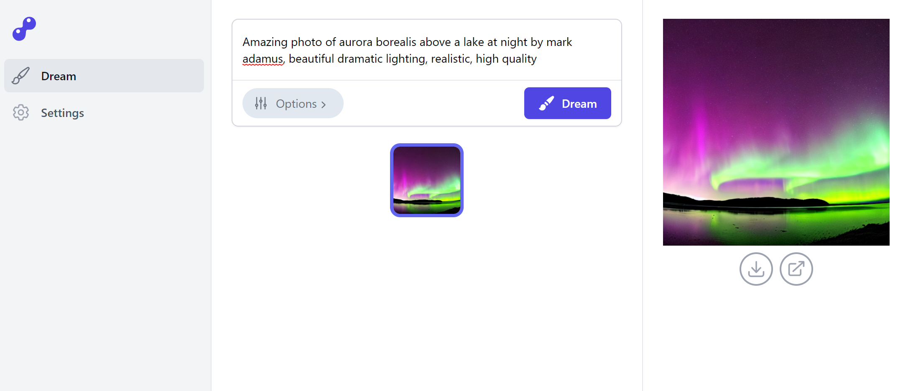

# FusionKit

## [Releases](https://github.com/fusion-kit/fusion-kit/releases)



FusionKit is a self-contained cross-platform app for generating images with [Stable Diffusion](https://github.com/CompVis/stable-diffusion). It leverages the [InvokeAI](https://github.com/invoke-ai/InvokeAI/) project to give a common set of useful features on top of Stable Diffusion, such as inpainting and preview generation.

(Windows or Linux with an Nvidia GPU is currently required; support for Apple Silicon Macs should be released soon)

## Features

- Txt2img: Enter a prompt and click "Dream" to generate one or more images!
- Img2img: Drag and drop a "base image" and enter a prompt to generate a new image based on the base image. Change the "base image decimation" option to tweak how similar or different the new image is from the original.
- Inpainting: Click the edit button next to the base image to draw a mask to replace only specific parts of an image.
- Image previews: View images as they are being generated.
- Configure multiple models: Switch between different Stable Diffusion model versions or model forks without restarting the app!
- All generated images are saved to disk automatically (past images aren't viewable in app yet).

## Download and setup

FusionKit is offered both as a self-contained Electron app and as a standalone headless server with a web UI. The Electron app is recommended, but the server could be useful if you want to use FusionKit on a remote machine. When using the server, the web UI can be accessed via `http://localhost:2424` by default.

After downloading the appropriate version for your platform from the ["Releases"](https://github.com/fusion-kit/fusion-kit/releases) page, unzip the archive and launch the app by opening the file named `fusion_kit_app.exe` or `fusion_kit_app` (for the server release, the file will be named `fusion-kit-server`).

When first launching the app, you'll be taken to the "Settings" page. You'll need to download or configure a Stable Diffusion model before using FusionKit. **After downloading or configuring a model, click "Save" on the Settings screen** and you'll be taken to the "Dream" page.

> **Security note**: The app build currently starts an HTTP server on localhost port 2424. In a multi-user environment, this may mean that other users on the same system can access FusionKit through a browser. In a future release, FusionKit will likely switch to a proper IPC mechanism instead.

> **Security note**: The server build has no authentication, but only listens on localhost by default. For added security, consider using a reverse proxy such as [Nginx Proxy Manager](https://nginxproxymanager.com/).

## Local development

FusionKit is broken up into 3 separate subprojects:

- `fusion_kit_server`: The Python backend, which exposes Stable Diffusion through a GraphQL API.
- `fusion_kit_client`: The React frontend.
- `fusion_kit_app`: The Electron app, which just wraps the backend and frontend.

### Dependencies

FusionKit uses [Anaconda](https://www.anaconda.com/) for dependency management. See the [Anaconda installation instructions](https://docs.anaconda.com/anaconda/install/) for details on setting up Anaconda for your platform.

After installing Anaconda, use the `conda-{platform}.yaml` file in this repo suitable for your platform. Each environment file will create an environment called `fusion-kit-{platform}`.

#### Windows setup

After installation, you should be able access Anaconda through "Anaconda Prompt (anaconda3)" in your Start menu.

```sh
git clone --recursive https://github.com/fusion-kit/fusion-kit.git
cd fusion-kit
git submodule update --init
conda env create -f conda-windows.yaml
conda activate fusion-kit-windows
```

If you've already created the Anaconda environment, you can update it by running `conda env update -f conda-windows.yaml --prune`, or recreate it by running `conda env remove -n fusion-kit-windows` followed by `conda env create -f conda-windows.yaml`.

#### Linux setup

Anaconda should be directly usable in your terminal after signing out and signing back in. If not, refer to the installation instructions to initialize Anaconda.

```sh
git clone --recursive https://github.com/fusion-kit/fusion-kit.git
cd fusion-kit
git submodule update --init
conda env create -f conda-linux.yaml
conda activate fusion-kit-linux
```

If you've already created the Anaconda environment, you can update it by running `conda env update -f conda-linux.yaml --prune`, or recreate it by running `conda env remove -n fusion-kit-linux` followed by `conda env create -f conda-linux.yaml`.

### Starting the project

First, make sure you have the FusionKit Anaconda environment active by running `conda activate fusion-kit-{platform}`.

Start the server by running the following command:

```sh
python fusion_kit_server/main.py
```

Start the client by running the following commands:

```sh
cd fusion_kit_client
npm install
npm run dev
```

The client should now be accessible at <http://localhost:2425>! You can also access the GraphQL API at <http://localhost:2424/graphql>.

### Building the project

At the moment, the build process is completely manual. To do the build, make sure you can start the project locally first.

**1. Build the client**

```sh
cd fusion_kit_client
npm install
npm run build
cd ..
```

**2. Build the server**

```sh
pyinstaller fusion_kit_server.spec --noconfirm
```

**3. Build the Electron app**

```sh
cd fusion_kit_app
npm install
npm run make
```

**4. Done**

- The client output is at `fusion_kit_client/dist/`, and is a static site.
- The server output is at `dist/fusion-kit-server/`. The executable is called `fusion-kit-server` and bundles the client (meaning that when you start the server, the UI can be accessed on <http://localhost:2424/>.).
- The Electron app output is at `fusion_kit_app/out/`. There is a platform directory containing the build, and a `make/` directory containing a zip file of the build.
